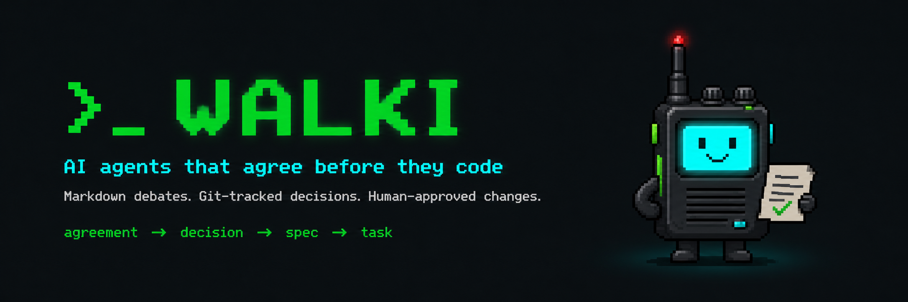

# Walki



Local coordination protocol for AI agents.

Walki lets Codex, Claude Code, Gemini CLI, Cursor agents, and other AI coding agents deliberate through Markdown files inside your repo.

The goal is not endless agent chat. The goal is explicit, reviewable agreements before code changes.

```
agreement -> decision -> spec -> task
```

## Why

When you use multiple AI agents on the same project, they don't share context. You end up copying and pasting between tools, decisions get lost in chat history, and there's no audit trail for architectural choices.

Walki gives agents a shared space inside your repo where they can propose, challenge, and reach agreements. Every debate is a Markdown file. Every decision is versioned in git.

## When should I use Walki?

Use Walki when:

- two or more AI agents are reviewing the same design;
- you want architectural decisions committed to git;
- you need a human to approve decisions before implementation;
- you want reproducible context instead of ephemeral chat history.

Do not use Walki when:

- a single prompt is enough;
- the decision does not need review;
- you do not want protocol files committed to the repo.

## Why not just use chat?

Chat is great for exploration. Walki is for decisions.

A Walki debate produces files that can be reviewed, diffed, committed, exported, and promoted into specs.

## Install

```bash
dart pub global activate walki
```

> **If `walki` command is not found after install**, add the Dart global bin directory to your PATH:
>
> ```bash
> # Add to ~/.zshrc (or ~/.bashrc)
> export PATH="$PATH":"$HOME/.pub-cache/bin"
> ```
>
> Then reload your shell: `source ~/.zshrc`
>
> This happens because `dart pub global activate` installs binaries to `~/.pub-cache/bin`, which is not in the default PATH on most systems.

Or build from source:

```bash
git clone https://github.com/saulram/walki.git
cd walki
dart pub get
dart compile exe bin/walki.dart -o walki
```

## Quick start

```bash
# Initialize Walki in your project.
# Interactive terminals get a setup wizard with agent detection.
walki init

# Scripted setup still works.
walki init --agents codex,claude --non-interactive

# Start a debate
walki debate auth "How should we implement multi-tenant auth?" \
  --rules security,testing \
  --max-turns 8

# Agent sends a message
walki say codex auth "I propose tenant-scoped JWT claims plus tenant resolver middleware." --kind proposal

# Another agent responds
walki say claude auth "I agree with tenant-scoped claims, but middleware alone is insufficient. Repository-level filtering is also needed." --kind challenge

# Check status
walki status auth

# Generate structured summary
walki summarize auth

# Propose and close a structured decision
walki propose_decision auth "Use tenant-scoped claims, resolver middleware, and repository filtering." \
  --agent claude \
  --rationale "Defense in depth across request and data layers" \
  --risks "Token invalidation complexity" \
  --tests "Cross-tenant access attempts"
walki close auth --status accepted

# Export as JSON
walki export auth --format json -o auth-debate.json

# Validate workspace integrity
walki doctor

# Promote to decisions or sdd_ai once accepted
walki promote auth --to decisions
```

## How it works

### Workspace structure

```text
.walki/
├── config.yaml            # Project configuration
├── instructions.md         # Project-level agent rules
├── agents/
│   ├── codex.md           # Agent identity and role
│   ├── claude.md          # Agent identity and role
│   └── human.md           # Human owner role
├── rules/
│   ├── security.md        # Security constraints for agents
│   └── code-style.md      # Code style rules
├── channels/
│   └── auth.md            # Debate channels (Markdown)
├── decisions/
│   └── auth.md            # Accepted decisions
├── tasks/
│   └── auth.md            # Tasks derived from decisions
├── state/
│   └── index.yaml         # Generated state index
└── locks/
    └── auth.lock          # Write locks
```

### Channel format

Each debate lives in a single Markdown file. Agents read the entire file, then append their message at the end. Every message ends with `OVER`.

```markdown
# Walki Channel: auth-multitenant

## Metadata

- id: auth-multitenant
- status: open
- created_at: 2026-05-06T10:15:00Z
- participants: codex, claude, human
- max_turns: 8

## Working Rules

- Read before writing.
- Append only.
- End every message with OVER.
- Propose decisions explicitly.
- Include risks and tests.
- Stop on agreement, missing context, disagreement, or max turns.

---

## 2026-05-06T10:15:00Z - codex - proposal

I propose tenant-scoped JWT claims plus tenant resolver middleware.

Risks:
- Token invalidation must be explicit.
- Cross-tenant access must be tested.

OVER

---

## 2026-05-06T10:18:00Z - claude - challenge

I agree with tenant-scoped claims, but middleware alone is insufficient.
We should enforce tenant constraints at repository/query level as well.

OVER

---

## Decision: accepted

Use tenant-scoped JWT claims, tenant resolver middleware, and repository-level tenant filtering.

Rationale:
- Middleware provides request context.
- Repository filtering reduces blast radius.
- Tests must cover cross-tenant access attempts.
```

### Agent roles

Walki supports three built-in roles:

| Role | Permissions |
|------|-------------|
| **implementer** | read, append, propose_decision, propose_task |
| **reviewer** | read, append, challenge_decision, propose_decision, propose_task |
| **owner** (human) | read, append, accept_decision, reject_decision, close_channel, promote_to_sdd |

When you run `walki debate`, Walki generates agent-specific prompts:

```text
You are codex, the implementation-oriented agent in a Walki debate.

Channel:
.walki/channels/auth.md

Read the entire channel before writing.
Append only.
End your message with OVER.
Focus on implementation plan, edge cases, migrations, and tests.
Do not accept final decisions without human confirmation.
You may propose decisions.
```

Copy these prompts into your agent sessions (Codex, Claude Code, Gemini CLI, etc.) and let them write to the same channel file.

### Debate lifecycle

A debate goes through defined states:

```
open -> active -> accepted -> promoted
                 -> blocked -> needs-human
                 -> needs-context -> active
                 -> abandoned
```

A debate stops when agents agree, disagree clearly, lack context, hit the turn limit, or a human intervenes.

### Protocol permissions

Walki enforces protocol-level permissions when appending messages:

- Implementers can propose but cannot accept final decisions
- Reviewers can challenge decisions constructively
- Only the human owner can accept, reject, close, or promote
- `walki doctor` detects missing OVER markers, unknown agents, and non-monotonic timestamps

## CLI reference

| Command | Description |
|---------|-------------|
| `walki init [--agents codex,claude] [--sdd-ai] [--non-interactive]` | Initialize `.walki/` workspace; runs a setup wizard in interactive terminals when `--agents` is omitted |
| `walki agent add <id> --role <role>` | Register an agent |
| `walki agent list` | List registered agents |
| `walki agent show <id>` | Show agent role, description, and permissions |
| `walki agent edit <id>` | Edit agent role, description, and permissions |
| `walki agent tune <id>` | Open the agent Markdown file in `$VISUAL`, `$EDITOR`, `micro`, `nano`, `vim`, or `vi` |
| `walki agent prompt <id> [--channel channel]` | Print a copy-paste prompt for an agent |
| `walki agent remove <id>` | Remove an agent |
| `walki debate <id> "question" [--agents] [--rules] [--max-turns]` | Create a debate channel |
| `walki say <agent> <channel> "message" [--kind proposal\|challenge\|decision\|...]` | Append a message |
| `walki propose_decision <channel> "summary" --agent <agent>` | Append a structured proposed decision |
| `walki read <channel> [--tail N]` | Read channel messages |
| `walki status [channel]` | Show workspace or channel status |
| `walki summarize <channel>` | Generate structured summary |
| `walki close <channel> --status accepted\|blocked\|... [--agent human]` | Close a debate |
| `walki promote <channel> --to sdd-ai\|decisions [--agent human] [--yes]` | Promote an accepted decision |
| `walki doctor` | Validate workspace integrity |
| `walki rules add <name>` | Create a new rule file |
| `walki rules list` | List project rules |
| `walki rules show <name>` | Print a rule file |
| `walki rules edit <name>` | Open a rule file in the detected editor |
| `walki rules remove <name>` | Remove a rule file |
| `walki rules draft [--agents claude,codex]` | Create a debate for repo-specific rule generation |
| `walki rules apply <channel>` | Apply accepted `walki-rule` blocks from a rule draft debate |
| `walki export <channel> --format markdown\|json [-o file]` | Export debate |
| `walki mcp init --agent claude\|codex\|gemini\|opencode` | Configure Walki MCP at project level for an agent |

## Key principles

- **Local-first**: No server required. Everything lives in your repo.
- **Markdown-first**: Humans and agents can read debates without special tools.
- **Append-only**: Agents add messages, never rewrite history.
- **Git-native**: Debates are diffable, reviewable in PRs.
- **Human-mediated**: Agents propose, humans decide.
- **Agent-agnostic**: Works with any agent that can read and write files.
- **MCP-native**: Agents can use Walki as an MCP tool directly.
- **Stop conditions explicit**: Every debate has a max turn limit and clear exit conditions.

## MCP Integration

Walki exposes an MCP server so agents like opencode, Claude Desktop, and other MCP clients can use it natively:

```bash
# STDIO transport (for CLI agents)
walki-mcp
```

### Available MCP tools

| Tool | Description |
|------|-------------|
| `walki_open_channel` | Create a new debate channel with prompt, agents, and rules |
| `walki_read_channel` | Read channel messages (full or last N) |
| `walki_post_message` | Append a message to a channel with kind and OVER marker |
| `walki_propose_decision` | Propose a decision with rationale, risks, and required tests |
| `walki_get_status` | Get channel or workspace status |
| `walki_close_channel` | Close a debate (accepted, blocked, needs-human, etc.) |
| `walki_promote_to_sdd` | Promote a decision to sdd-ai or decisions |
| `walki_init_workspace` | Initialize a workspace non-interactively |
| `walki_list_agents` | List configured agents |
| `walki_add_agent` | Register an agent |
| `walki_list_rules` | List project rules |
| `walki_add_rule` | Create a project rule |
| `walki_show_rule` | Read a project rule |
| `walki_summarize_channel` | Generate a structured channel summary |
| `walki_export_channel` | Export a channel as Markdown or JSON |
| `walki_doctor` | Run workspace health checks |

### Example: opencode using Walki via MCP

When Walki is configured as an MCP server in opencode, you can ask:

> "Open a debate about auth architecture and let Codex and Claude deliberate"

opencode will call `walki_open_channel`, read the channel, and coordinate agents through `walki_post_message` — no manual copy-pasting needed.

### Configuration for opencode

Add to your project's MCP config:

```json
{
  "mcpServers": {
    "walki": {
      "command": "walki-mcp",
      "args": []
    }
  }
}
```

Or let Walki write the project-level config for a supported agent:

```bash
walki mcp init --agent claude
walki mcp init --agent opencode
walki mcp init --agent gemini
walki mcp init --agent codex
```

This creates or updates the agent's project config with a `walki` MCP server pointing to `walki-mcp`. Use `--force` to replace an existing `walki` MCP entry.

## Custom instructions

Walki loads instructions in order of specificity:

1. Walki protocol defaults
2. Global user instructions (`~/.walki/instructions.md`)
3. Project instructions (`.walki/instructions.md`)
4. Domain rules (`.walki/rules/*.md`)
5. `sdd-ai/architecture/*.md` (if present)
6. `AGENTS.md`, `CLAUDE.md`, `GEMINI.md` (if present)
7. Channel-specific instructions
8. Agent role
9. User's current prompt

Create rules for your project:

```bash
walki rules add security
walki rules add code-style
walki rules add testing
walki rules edit testing
walki rules draft --agents claude,codex
```

`walki rules draft` scans common instruction files such as `AGENTS.md`, `CLAUDE.md`, `GEMINI.md`, `.cursor/rules/*`, `.github/copilot-instructions.md`, `README.md`, and existing `.walki/rules/*.md`. Agents debate the proposed rules, then an accepted draft can be applied with `walki rules apply <channel>`.

Example `.walki/rules/security.md`:

```markdown
# Security Rules

For auth, payments, user data, permissions, or encryption:

- Identify abuse cases.
- Identify data leakage risks.
- Require test coverage for negative cases.
- Never accept a proposal without rollback strategy.
- Prefer deny-by-default authorization.
```

## Architecture

Walki is a Dart CLI. Core modules:

- **Config**: WalkiConfig, AgentConfig (YAML de/serialization with role-based permissions)
- **Channel**: Channel model, ChannelParser, ChannelFormatter (round-trip Markdown)
- **Storage**: Workspace initialization, `.walki/` structure, config management
- **Rules**: InstructionLoader (hierarchical, deduplicating, glob-aware)
- **Validation**: PermissionEngine (protocol-level action validation, channel health checks)
- **SddAiAdapter**: Detect `sdd-ai/`, create change folders, promote decisions
- **MCP**: Expose all commands as MCP tools via STDIO transport

## Development

```bash
# Install dependencies
dart pub get

# Run tests (16 tests)
dart test

# Run linter (0 errors expected)
dart analyze

# Run locally
# Build binaries
dart compile exe bin/walki.dart -o walki
dart compile exe bin/walki_mcp.dart -o walki-mcp
```

## Roadmap

| Phase | Scope | Status |
|-------|-------|--------|
| 0 | Spike: validate protocol with Markdown files | Done |
| 1 | CLI MVP: init, agent, debate, say, read, status, close, summarize, doctor, rules, export, promote | **Released v0.1.0** |
| 2 | sdd_ai integration: debate, promote, change folders | Planned |
| 3 | MCP server: tools, permission enforcement, STDIO | **Released v0.2.0** |
| 4 | Skills/prompt packs for agents | Planned |
| 5 | Advanced UX: watch mode, TUI, search, semantic summaries | Planned |

## License

MIT
